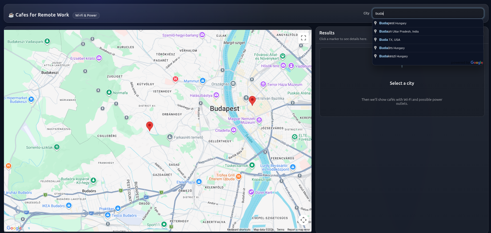

I connected the app to Google Places API, searching for cafes within 5km from city center. 
Then I filtered it using Google Reviews and OSM showing only those cafes with Wi-Fi for remote work.

Worth to mention that the search field is implemented using Google Maps Places API for Auto-Complete, only valid city names are accepted in the app. 